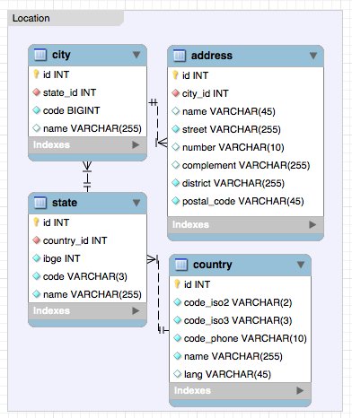

# laravel-states-and-cities

- Laravel.
- País, estados e cidades. 
- Já populado com estados e cidades brasileiras com código do IBGE

### Tasks

Lista de prioridades de novas implementações

- Traid e contrato
    - Criar uma traid para que qualquer model (empresa,pessoa,fornecedores) possua endereços atraves de uma tabela pivo dinamica.
- Melhorar o script JS
    - Consulta de CEP para selecionar estado e cidade automaticamente ao retornar o endereço do cep digitado.
    
Ajude-nos! Vamos fazer isso juntos, faça seu fork!

### DER - RELATIONAL ENTITY DIAGRAM


## Instalação

Via composer
 
```
composer require blitsoftwares/laravel-states-and-cities
```
 
 ou manualmente adicione no seu composer.json
 
```
{
    "require": {
    "blitsoftwares/laravel-states-and-cities": "~1.0"
    }
} 
```
  
### 2. Provider

Se você está usando Laravel 5.5+ pule esta sessão, pois nosso pacote possui suporte à auto-discovery.

```
'providers' => [
        Blit\StatesAndCities\Providers\StatesAndCitiesServiceProvider::class,
    ],
```

### 3. Migration

Execute as migrações, as tabelas serão criadas em seu banco de dados;
```
php artisan migrate 
```

### 4. Seeder

Atualmente está disponível via seeder o Brasil, com todos os estados e cidades.
Estados e cidades possuem código do IBGE

Quem desejar contribuir na implementação de novos países, fique à vontade, faça o fork, implemente os seeds e envie seu PullRequest.

```
php artisan db:seed --class=Blit\\StatesAndCities\\Seeds\\DatabaseSeeder 
```

### 5. Publish

Publique os arquivos do pacote:

```
php artisan vendor:publish --provider=Blit\\StatesAndCities\\Providers\\StatesAndCitiesServiceProvider
```
    
#### Arquivos a serem publicados

- Lang (traduções)
	- resources/lang/vendor/StatesAndCities
- Views
	- resources/views/vendor/StatesAndCities
- Assets
	- public/vendor/StatesAndCities
- Config
	- config/states-and-cities.php
	
### 6. Routes 

Rotas disponíveis

- /countries
- /states
- /cities
- /addresses

### 7. Javascript

Para que os selects entre países, estados e cidades fiquem dinâmicos, é necessário adicionar o JS do pacote, juntamente com o jquery.mask
para que o campo de CEP fique com máscara.

6.1 - Adicione no fim do seu layout (template)
```
<script src="//oss.maxcdn.com/jquery.mask/1.11.4/jquery.mask.min.js"></script>
<script src="/vendor/StatesAndCities/js/blit-states-and-cities.js"></script>
```

### Manualmente

Caso você esteja integrar países, cidades e estados em seu formulário, basta adicionar os selects abaixo.

Não mude o ID do componente, pois o JS usa ele para fazer os loads. 
O atributo NAME pode ser personalizado conforme sua tabela de endereços.

Para países (necessário para load de estados)
```
<select name="country_id" id="country" data-default="{{ config('states-and-cities.default-country') }}"></select>
```

Para estados (necessário para o load de cidades)
```
<select name="state_id" id="state" data-default="{{ config('states-and-cities.default-state') }}"></select>
```

Para cidades
```
<select name="city_id" id="city" data-default="{{ config('states-and-cities.default-city') }}"></select>
```

Para CEP
```
<input name="postal_code" id="postal_code" data-autocomplete="true" data-mask="{{ config('states-and-cities.postal_code_mask') }}" type="text" }}">
```

### Configurações

Na pasta config do laravel, se encontra publicado o arquivo de configuração do pacote:

- states-and-cities.php

Nele possi algumas variáveis que pode ser personalizada conforme sua necessidade:

- default-country :: País padrão para o auto load
- default-state :: Estado padrão para o auto load
- default-city :: Cidade padrão para o auto load
- postal_code_mask :: Padrão para máscara do CEP usando nosso componente
- routes_middleware :: Middleware para as rotas

Os valores a serem adicionados nas 3 primeiras variáveis são os IDs da sua respectiva tabela, acesse as rotas e olhe a coluna # que possui os ids dos registros.

### Auto preencher com CEP digitado

O pacote está integrado com VIACEP. 
Para utilizar, use o componente de CEP na sessão MANUALMENTE e adicione os campos de endereços com os IDs abaixo:

Para logradouro:
```
<input id="street" >
```

Para bairro:
```
<input id="district" >
```

Os seletores automáticos para estado e cidade após uma consulta do CEP, ainda será implementado.

## Traduções

As views de cadastros nativas de países, estados, cidades e endereços, estão integradas com o LANG do laravel.
Idiomas disponívies

- Portugues Brasil (pt-br)
- Inglês (en)

Os arquivos estão disponíveis na pasta:

- resources/lang/vendor/StatesAndCities

Configure o locale do seu laravel.

## Informações

Este pacote é mantido pela equipe de desenvolvedores da Blit Softwares.
Faça um fork e nos ajude com novidades e eventuais falhas.

- Contato
    - Blit Softwares <falecom@blitsoft.com.br>
    - http://blitsoft.com.br


